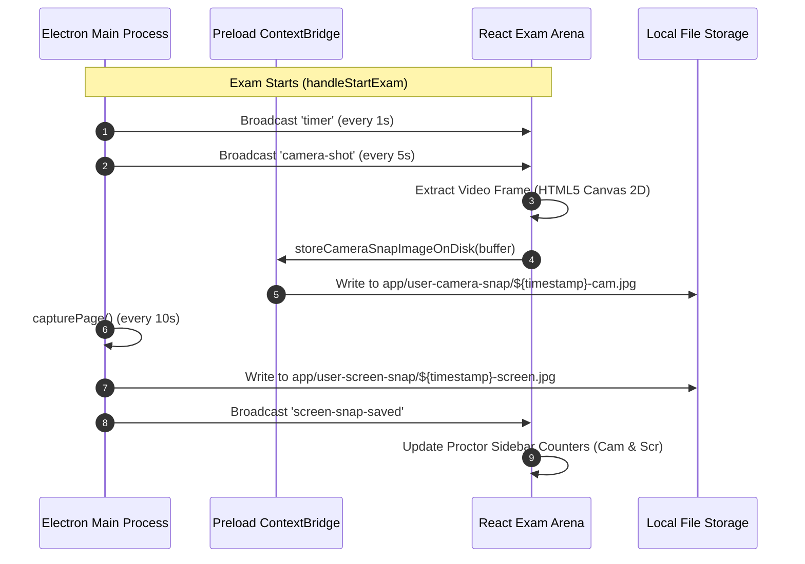

# Athena Clone

Athena Clone is a proctored online examination and assessment desktop application built with **Electron**, **React**, and **Express**. It integrates real-time webcam proctoring, automated full-screen/window screenshot captures, fullscreen security enforcement, automated timer synchronization, and a full-featured MCQ examination lifecycle powered by an Express REST API.

---

## Today's Lab Work - 2026-09-24

### Automated Proctoring Screenshot Engine & Stream Resilience Hardening
- **Automated Dual-Source Proctoring Snapshots**:
  - **Continuous Webcam Capture**: Automatically captures candidate webcam snapshots every 5 seconds and writes JPEG buffers directly to disk at `app/user-camera-snap/${timestamp}-cam.jpg`.
  - **High-Resolution Exam Screen Capture**: Uses Electron `webContents.capturePage()` to capture full exam window screenshots every 10 seconds, stored at `app/user-screen-snap/${timestamp}-screen.jpg`.
  - **Instant Manual Snapshot Trigger**: Added a dedicated **"📸 Capture Snapshot Now"** CTA in the exam arena sidebar for on-demand evaluator validation with pulse flash UI feedback.
- **Resilient Multi-Environment Fallback Architecture**:
  - Engineered an offscreen HTML5 `<canvas>` 2D frame extraction pipeline that works reliably in all browsers and Electron without failing on camera lockouts.
  - Retained `ImageCapture` track snapshot extraction as a supplementary fallback.
  - Resolved MediaStream unmounting issue: Maintained persistent `mediaStream` state across React stage transitions (`SETUP` -> `EXAM` -> `RESULTS`), preventing the webcam feed from going blank.
  - Implemented automatic browser timer & snapshot capture intervals when running outside Electron.
- **Proctoring Telemetry & Final Audit**:
  - Real-time badges for webcam frames (`📹 X cam`) and screen captures (`🖥️ Y scr`) in the active exam proctor sidebar.
  - Post-exam scorecard breakdown displaying complete proctoring audit metrics alongside accuracy score and timestamped responses.

---

## Yesterday's Lab Work - 2026-09-23

### Dual Proctoring Screenshot Architecture & Storage Pipeline
- **Electron IPC Screen Capture Pipeline**:
  - Engineered `capture-screen-snap` and `store-screen-snap-image-on-disk` IPC handlers in `app/app.js` and `app/preload.js`.
  - Automatic recursive storage directory creation for `app/user-camera-snap/` and `app/user-screen-snap/`.
  - Configured synchronized periodic timer broadcasts for candidate timer ticks (1s), camera capture events (5s), and screen capture events (10s).
- **Stream Lifecycle & Canvas Frame Capture Engine**:
  - Designed `mediaStream` coordinator in `src/App.jsx` to prevent MediaStream garbage collection during stage transitions.
  - Built canvas blob-to-buffer conversion utility for saving candidate photos directly to local disk storage.
  - Implemented automatic `stop-proctoring` cleanup upon final exam submission (`POST /exam/submit`).

---

## Backend API Endpoints & Frontend Integration Map

| # | HTTP Method | Endpoint | Backend Purpose | Frontend Component & Usecase |
|---|---|---|---|---|
| **1** | `GET` | `/` | Health check | `Header.jsx`, `PreExamSetup.jsx`: Live server connection status badge and retry trigger. |
| **2** | `POST` | `/exam/start` | Starts new session | `PreExamSetup.jsx`: Initializes exam session with `userId` and `name`, returns `sessionId`. |
| **3** | `GET` | `/exam/mcq` | Returns all questions | `App.jsx`, `ExamArena.jsx`: Populates question palette navigation, progress tracker, and filters. |
| **4** | `GET` | `/exam/mcq/:id` | Returns single question | `ExamArena.jsx`: Fetches question prompt and option choices dynamically when navigated to. |
| **5** | `POST` | `/exam/answer` | Validates & saves answer | `ExamArena.jsx`: Submits option index (`selectedAnswer`), receives server validation and updates stats. |
| **6** | `GET` | `/exam/session/:sessionId` | Returns session progress | `ExamArena.jsx`, `ExamResults.jsx`: Live session sync button, answered status tracking, and final scorecard audit. |
| **7** | `POST` | `/exam/submit` | Submits exam | `ExamArena.jsx`: Marks session as submitted, locks test, and returns final attempted/correct/wrong totals. |

---

## Proctoring Architecture & Storage Layout

```text
app/
├── app.js                     # Main Electron process (IPC, Timers, Window Captures)
├── preload.js                 # ContextBridge secure APIs (athena.captureScreenSnap, athena.storeCameraSnapImageOnDisk)
├── user-camera-snap/          # Automatically saved webcam snapshots (*-cam.jpg)
└── user-screen-snap/          # Automatically saved full exam window screenshots (*-screen.jpg)
```

### Proctoring Snapshot Execution Cycle



---

## Previous Lab Work

### Complete Frontend & Backend Integration - 2026-09-22
- **All 7 Backend Endpoints Fully Integrated**: Connected the React frontend with the Express backend (`http://localhost:3000`) without omitting any endpoint.
- **Created Unified API Service Layer (`src/services/api.js`)**: Encapsulated all HTTP requests (`fetch` API) with structured error handling, payload formatting, and connectivity diagnostics.
- **Pre-Exam Candidate Onboarding (`src/components/PreExamSetup.jsx`)**:
  - Added candidate verification inputs for Student ID (`userId`) and Full Name (`name`).
  - Integrated `GET /` connectivity check badge with automatic health polling and manual retry button.
  - Required camera hardware verification and fullscreen enablement before enabling the **Start Examination** CTA.
  - Linked native Electron rules dialog (`window.athena.showRules()`) and an in-app interactive modal.
- **Interactive Examination Arena (`src/components/ExamArena.jsx`)**:
  - **Auto-Save on Selection**: Selecting any option automatically persists candidate's choice in state across all question switches and immediately syncs with `POST /exam/answer`.
  - **Final Submission Auto-Flush**: When clicking *Submit Exam*, all selected/drafted options are automatically validated and submitted to the backend before calling `POST /exam/submit`.
  - **Question Navigation Palette (`GET /exam/mcq`)**: Displays all assessment questions with status tags (Current, Answered / Auto-saved, Unanswered) and quick filter tabs.
  - **Dynamic Question Loader (`GET /exam/mcq/:id`)**: Fetches specific question data on demand when switching questions or clicking palette chips.
  - **Single-Attempt Answer Submission (`POST /exam/answer`)**: Submits chosen MCQ option to backend, locks answered questions per backend rules, and provides instant confirmation.
  - **Live Session Progress Telemetry (`GET /exam/session/:sessionId`)**: Synchronizes live score, attempted count, remaining questions, and answered records with a dedicated "Sync Progress" trigger.
  - **Final Submission Confirmation Modal (`POST /exam/submit`)**: Displays auto-saved question counts, warns user about unanswered questions, completes the exam session, and transitions to results.
- **Comprehensive Scorecard & Result Review (`src/components/ExamResults.jsx`)**:
  - Displays summary metrics: Total Questions, Attempted, Correct, Wrong, and Accuracy Percentage.
  - Full Question-by-Question Response Audit fetched from `GET /exam/session/:sessionId` with submitted choices and timestamps.
  - Provides a **Start Another Examination** workflow to reset and take new tests cleanly.

### Backend Lab Work - 2026-09-21
- Added Express backend in `backend/` on port `3000` with `cors` and JSON middleware.
- Built JSON persistence using `backend/data/questions.json` and `backend/data/sessions.json`.
- Implemented secure answer verification where `correctAnswer` is kept strictly on server.

### Proctoring Foundation Lab Work - 2026-09-20
- Added Electron IPC listeners for main-process timer ticks and periodic camera snapshot events.
- Used browser `ImageCapture` API to take camera snapshots every 5 seconds.
- Implemented `storeCameraSnapImageOnDisk` to save JPG files in `app/user-camera-snap/`.
- Added native Electron contest rules dialog via `dialog.showMessageBox`.

---

## Project Structure

```text
Athena-Clone/
├── app/
│   ├── app.js                 # Electron main process (Window management, IPC timers, snapshot storage)
│   ├── preload.js             # Secure contextBridge exposing window.athena API
│   ├── user-camera-snap/      # Automated webcam snapshot repository (*-cam.jpg)
│   └── user-screen-snap/      # Automated exam screen snapshot repository (*-screen.jpg)
├── backend/
│   ├── data/
│   │   ├── questions.json     # Question bank (with server-side correctAnswer)
│   │   └── sessions.json      # Exam sessions database
│   ├── package.json           # Backend Express configuration
│   ├── server.js              # Express REST API (7 endpoints)
│   └── README.md              # Backend documentation
├── src/
│   ├── components/
│   │   ├── ExamArena.jsx      # Active exam interface (palette, question workspace, live proctoring)
│   │   ├── ExamResults.jsx    # Post-exam scorecard and detailed response audit breakdown
│   │   ├── Header.jsx         # Top navbar with live timer, session badge, and API health status
│   │   ├── PreExamSetup.jsx   # Candidate ID/Name setup, camera verification, fullscreen mode
│   │   └── RulesModal.jsx     # Exam instructions dialog with native Electron trigger
│   ├── services/
│   │   └── api.js             # API client functions for all 7 backend endpoints
│   ├── App.css                # Polished, responsive component styles
│   ├── App.jsx                # Main application coordinator & stage state manager
│   ├── index.css              # Global tokens and design system
│   └── main.jsx               # React DOM entry point
├── package.json
└── README.md
```

---

## Quick Start Guide

### 1. Install Dependencies

Root application:
```bash
npm install
```

Backend server:
```bash
cd backend
npm install
cd ..
```

---

### 2. Start the Backend Server

```bash
cd backend
npm start
```
*The backend starts at `http://localhost:3000`.*

---

### 3. Start the Frontend & Electron Desktop App

In **Terminal 1** (Vite development server):
```bash
npm run dev
```

In **Terminal 2** (Electron Desktop window):
```bash
npm run electron
```

---

## Build & Quality Commands

```bash
npm run lint       # Run ESLint validation
npm run build      # Compile production Vite bundle
npm run preview    # Preview built application
```
